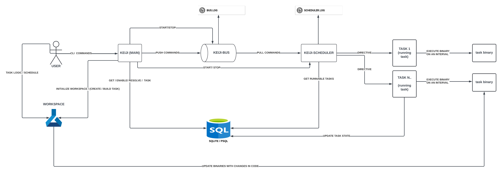

# KEIJI - 計時 (time keeping)

## MOTIVIATION

- Develop a concurrent task scheduling system in go.


## SYSTEM OVERVIEW


### Description

```
describe the system overview
```

## INSTALLATION

```
go install github.com/aodr3w/keiji@latest
```

After install, `keiji command should be available`


## USAGE

## STEP 1: Initializing a workspace

**command**

```
keiji init
```
 
**output**

```
2024/08/10 18:43:43 open /Users/andrewodiit/keiji/settings.conf: no such file or directory
2024/08/10 18:43:43 Initializing work space...
2024/08/10 18:43:53 service scheduler not found
2024/08/10 18:43:53 service bus not found
2024/08/10 18:43:53 installing scheduler
2024/08/10 18:43:58 ok
2024/08/10 18:43:58 installing bus
2024/08/10 18:44:01 ok
```

after `initialization` you should have the following folder structures in your system 

`$HOME/keiji`

```
keiji
├── go.mod
├── go.sum
├── settings.conf
└── tasks
```
- `go.mod & go.sum` - all workspace dependencies used by your tasks.

- `settings.conf` - database , timezone & log rotation settings.

- `tasks/` - task source code is stored here after creation.


`$HOME/.keiji`

```
.keiji
├── db
│   └── keiji.db
└── logs
    └── services
        ├── bus
        │   └── bus.log
        ├── repo
        │   └── repo.log
        └── scheduler
            └── scheduler.log

```

`db` - contains the default `sqllite3 db` created ud

**WARNING ⚠️ : DO NOT MODIFY THE STRUCTURE OF THESE DIRECTORIES**


## STEP 2: create tasks

```
keiji task --create --name=ping_google --desc="pings google"
```

```
$WORKSPACE/
└── tasks/
    └── ping_google/
        ├── schedule.go
        ├── main.go
        └── function.go
```

## STEP 3: build & save task

```
keiji task --name=ping_google --build
```


## STEP 4: check task details

```
keiji task --get --name=ping_google
```


## STEP 5: start system

```
keiji system --start
```

```
keiji system --status
```

## STEP 6: view logs

```
keiji system --logs --bus 
```

```
keiji system --logs --scheduler --vim
```

```
keiji task --logs --name=ping_google --nano
```


## STEP 7: modify task functionality

**update source code**

**update schedule**

**check task details**


## STEP 8: disable a task

```
keiji task --disable --name=ping_google`
```

## STEP 9: delete a task

```
keiji task --delete --name=ping_google
```


## STEP 10: changing database

```
modify settings.conf in workspace && restart system
```


## STEP 9: enable/disable log rotation

```
modify settings.conf in workspace && restart system
```

## STEP 10: stop system

```
keiji system --stop
```

## STEP 12: uninstall system

```
keiji system --uninstall
```


